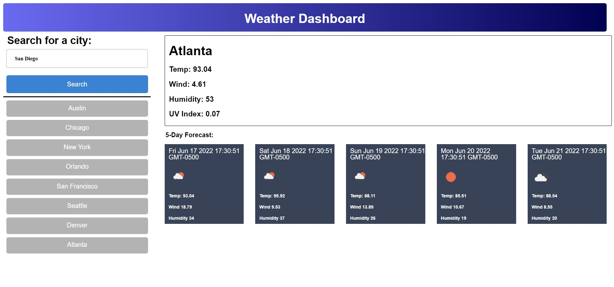

# Weather Dashboard, Module-6-Challenge

    In this assignment I created a weather dashboard
    using my html, css and javascript skills. This
    application allows the user to search a city and
    see the current weather, as well as the current
    forecast for the next five days. Once another city
    is searched, a button to redisplay the previously 
    searched city will pop up in the left column. This
    application is very simple and intuitive to use.

    [Website](https://ianbridges.github.io/Module-6-Challenge/)

    